# Urban Accessibility — How close is my nearest Żabka ?

## 0. Motivation / Project idea

This project leans heavily on the methodologies used by [Milan Janosov](https://medium.com/@janosovm) in [Urban Accessibility — How to Reach Defibrillators on Time](https://towardsdatascience.com/urban-accessibility-how-to-reach-defibrillators-on-time-c865d9194448).  His articles are a true inspiration.  I strongly recommend giving him a follow on [Patreon](https://patreon.com/milanjanosov?utm_medium=clipboard_copy&utm_source=copyLink&utm_campaign=creatorshare_fan&utm_content=join_link).

On arrival in Kraków one of the first things to grab my attention was the number of Żabka convenience stores. Those little green frogs seem to be everywhere!

<div>

</div>


I thought it would be fun to perform a geospatial analysis of the accessibility of these stores. For comparison purposes I chose to also look at Poznań. 

## 1. Packages

The project harnesses a number of Python libraries. I was familiar with most of these but this was my first look at Uber's [H3: Uber’s Hexagonal Hierarchical Spatial Index](https://www.uber.com/en-HU/blog/h3/). 


- [pandas](https://pandas.pydata.org/)
- [NumPy](https://numpy.org/)
- [OSMnx](https://osmnx.readthedocs.io/en/stable/)
- [matplotlib](https://matplotlib.org/)
- [pandana](https://udst.github.io/pandana/)
- [geopandas](https://geopandas.org/en/stable/gallery/create_geopandas_from_pandas.html)
- [shapely](https://shapely.readthedocs.io/en/stable/manual.html)
- [h3](https://h3geo.org/)
- [rioxarray](https://corteva.github.io/rioxarray/stable/)
- [Xarray](https://docs.xarray.dev/en/stable/)
- [Datashader](https://datashader.org/)

### 1.1 Administrative boundaries

First up, we leverage [OSMnx](https://osmnx.readthedocs.io/en/stable/) to very quickly grab the administrative boundaries of Kraków and Poznań :


```python
import osmnx as ox # version: 1.0.1
import matplotlib.pyplot as plt # version: 3.7.1

admin  = {}
cities = ['Poznań', 'Kraków']
f, ax  = plt.subplots(1,2, figsize = (15,5))

# visualize the admin boundaries
for idx, city in enumerate(cities):
    admin[city] = ox.geocode_to_gdf(city)
    admin[city].plot(ax=ax[idx],color='none',edgecolor= 'k', linewidth = 2), ax[idx].set_title(city, fontsize = 16)
```


    
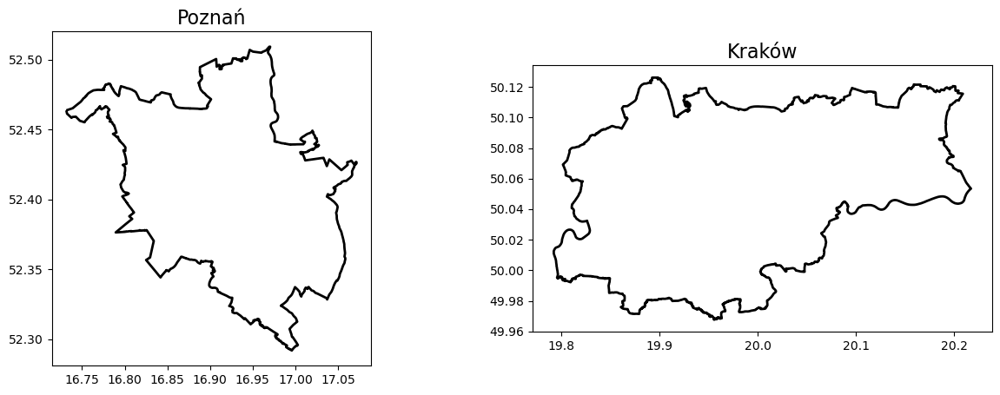
    


### 1.2. Population data

We can create population grids in vector data format for both cities, building on this fine-grained population estimate data source which can be downloaded as a `.tif` file via [WorldPop Hub](https://hub.worldpop.org/geodata/summary?id=49862) using the constrained individual countries data set at a resolution of 100m curated in 2020.


```python
import warnings
warnings.filterwarnings("ignore")
```


```python
import rioxarray
# rioxarray 0.13.4
import xarray as xr # 2022.3.0
import datashader as ds  # version: 0.15.2
import pandas as pd
import numpy as np
from colorcet import palette
from datashader import transfer_functions as tf
```

We can work with `.tif` files using [rioxarray](https://corteva.github.io/rioxarray/stable/) :  


```python
# # parse the data
poland_file  = "pol_ppp_2020_constrained.tif" 
poland_array = rioxarray.open_rasterio(poland_file, chunks=True, lock=False)
```

And quickly visualize the population of Poland from this raster file using Matplotlib. 


```python
# prepare the data
poland_array = xr.DataArray(poland_array)[0]
poland_array = poland_array.where(poland_array > 0)
poland_array = poland_array.compute()
poland_array = np.flip(poland_array, 0)


# get the image size
size = 1200
asp  = poland_array.shape[0] / poland_array.shape[1]

# create the data shader canvas
cvs = ds.Canvas(plot_width=size, plot_height=int(asp*size))
raster = cvs.raster(poland_array)

# draw the image
cmap = palette["fire"]
img = tf.shade(raster, how="eq_hist", cmap=cmap)
img = tf.set_background(img, "black")
img
```

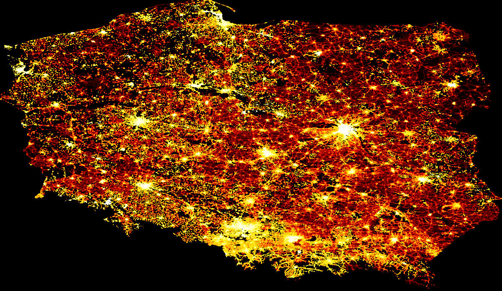

We can clearly see the populous cities of (from west to east) Szczecin, Poznań, Wrocław, Gdańsk, Katowice, Łódź, Kraków and Warsaw.

Now that we have visualized Poland let's look at things at a city level and show you how to transform such raster data into vector format and manipulate it easily with GeoPandas. For this, I access the administrative boundaries of Kraków in a geojson format [here](https://github.com/dchoruzy/poland-geojson/blob/master/cities/high-quality/krakow/krakow.geojson). This file contains the boroughs of Kraków, so first, we need to merge them into the city as a whole :


```python
from shapely.ops import cascaded_union
import geopandas as gpd

# Read the GeoJSON file
krakow = gpd.read_file('krakow.geojson')

# Perform cascaded union on the geometries and create a new GeoDataFrame
krakow = cascaded_union(krakow['geometry'])
krakow = gpd.GeoDataFrame(geometry=[krakow])

# Plot the resulting GeoDataFrame
krakow.plot()
```


    
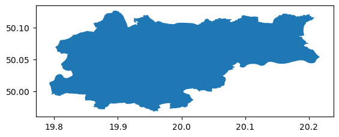
    


Now we can turn the xarray into a Pandas DataFrame, extract the geometry information, and build a GeoPandas GeoDataFrame. One way to do this:


```python
import pandas as pd # version: 1.4.2
from shapely.geometry import Point

df_poland = pd.DataFrame(poland_array.to_series(), columns = ['population']).dropna()
df_poland
```


<div>
<style scoped>
    .dataframe tbody tr th:only-of-type {
        vertical-align: middle;
    }

    .dataframe tbody tr th {
        vertical-align: top;
    }

    .dataframe thead th {
        text-align: right;
    }
</style>
<table border="1" class="dataframe">
  <thead>
    <tr style="text-align: right;">
      <th></th>
      <th></th>
      <th>population</th>
    </tr>
    <tr>
      <th>y</th>
      <th>x</th>
      <th></th>
    </tr>
  </thead>
  <tbody>
    <tr>
      <th rowspan="5" valign="top">49.060000</th>
      <th>22.685000</th>
      <td>0.479311</td>
    </tr>
    <tr>
      <th>22.685833</th>
      <td>0.478492</td>
    </tr>
    <tr>
      <th>22.686667</th>
      <td>0.481470</td>
    </tr>
    <tr>
      <th>22.687500</th>
      <td>0.479595</td>
    </tr>
    <tr>
      <th>22.688333</th>
      <td>0.475236</td>
    </tr>
    <tr>
      <th>...</th>
      <th>...</th>
      <td>...</td>
    </tr>
    <tr>
      <th rowspan="4" valign="top">54.834167</th>
      <th>18.323333</th>
      <td>3.238961</td>
    </tr>
    <tr>
      <th>18.324167</th>
      <td>3.084985</td>
    </tr>
    <tr>
      <th>18.325000</th>
      <td>2.966888</td>
    </tr>
    <tr>
      <th>18.325833</th>
      <td>2.802020</td>
    </tr>
    <tr>
      <th>54.835833</th>
      <th>18.290000</th>
      <td>2.172088</td>
    </tr>
  </tbody>
</table>
<p>20286799 rows × 1 columns</p>
</div>


Now build a GeoDataFrame from this, focusing on Krakow :


```python
# find the limiting bounding box for easier coodinate-selection
minx, miny, maxx, maxy = krakow.bounds.T[0].to_list()

points = []
population = df_poland.population.to_list()
indices = list(df_poland.index)
```


```python
# create Point geometries from the points falling into this bounding box
geodata = []
for ijk, (lon, lat) in enumerate(indices):
    if minx <= lat <= maxx and miny <= lon <= maxy:   
        geodata.append({'geometry' : Point(lat, lon), 'population' : population[ijk]})
        
len(geodata)
```


    80807


```python
# build a GeoDataFrame
gdf_krakow = gpd.GeoDataFrame(geodata)
gdf_krakow = gpd.overlay(gdf_krakow, krakow)
gdf_krakow.head()
```


<div>
<style scoped>
    .dataframe tbody tr th:only-of-type {
        vertical-align: middle;
    }

    .dataframe tbody tr th {
        vertical-align: top;
    }

    .dataframe thead th {
        text-align: right;
    }
</style>
<table border="1" class="dataframe">
  <thead>
    <tr style="text-align: right;">
      <th></th>
      <th>population</th>
      <th>geometry</th>
    </tr>
  </thead>
  <tbody>
    <tr>
      <th>0</th>
      <td>7.174075</td>
      <td>POINT (19.95583 49.96833)</td>
    </tr>
    <tr>
      <th>1</th>
      <td>7.512988</td>
      <td>POINT (19.95500 49.96917)</td>
    </tr>
    <tr>
      <th>2</th>
      <td>6.941103</td>
      <td>POINT (19.95583 49.96917)</td>
    </tr>
    <tr>
      <th>3</th>
      <td>6.333723</td>
      <td>POINT (19.95667 49.96917)</td>
    </tr>
    <tr>
      <th>4</th>
      <td>6.613466</td>
      <td>POINT (19.95750 49.96917)</td>
    </tr>
  </tbody>
</table>
</div>


Then, visualize the population as vector data:  


```python
import matplotlib.pyplot as plt # version: 3.7.1

f, ax = plt.subplots(1,1,figsize=(15,15))
gdf_krakow.plot(ax=ax, color = 'k', edgecolor = 'orange', linewidth = 3)
gdf_krakow.plot(column = 'population', cmap = 'inferno', ax=ax, alpha = 0.9, markersize = 0.25)
ax.axis('off')
f.patch.set_facecolor('black')
```


    
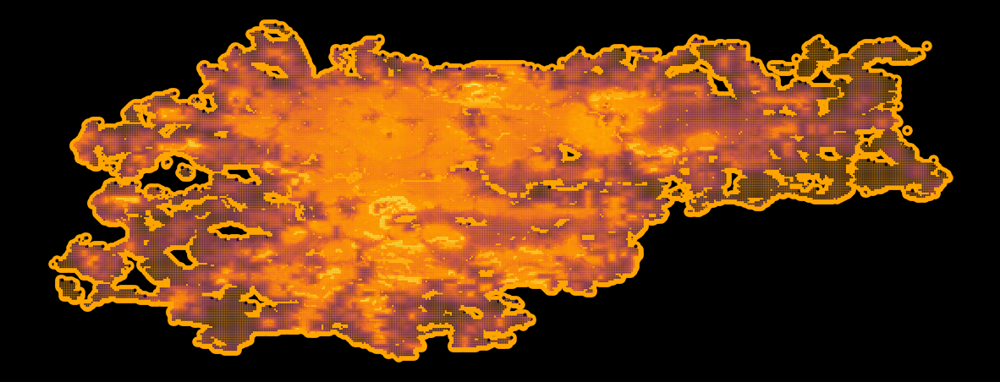
    


```python
type(gdf_krakow)
```


    geopandas.geodataframe.GeoDataFrame


```python
# Specify the output file path and name
output_file = 'kraków_population_grid.geojson'

# Save the GeoDataFrame as a GeoJSON file
gdf_krakow.to_file(output_file, driver='GeoJSON')
```

I performed the same steps for Poznań.

We can make things look nice by creating a custom colormap from the color of 2022, Very Peri.


```python
import matplotlib.pyplot as plt
from matplotlib.colors import LinearSegmentedColormap

very_peri = '#8C6BF3'  
second_color = '#6BAB55'   

colors = [second_color, very_peri]
n_bins = 100
cmap_name = "VeryPeri"
colormap = LinearSegmentedColormap.from_list(cmap_name, colors, N=n_bins)
```


```python
import geopandas as gpd # version: 0.9.0

demographics = {}
f, ax = plt.subplots(1,2, figsize = (15,5))

for idx, city in enumerate(cities):
    demographics[city] = gpd.read_file(city.lower() + \
      '_population_grid.geojson')[['population', 'geometry']]
    admin[city].plot(ax=ax[idx], color = 'none', edgecolor = 'k', \
      linewidth = 3)
    demographics[city].plot(column = 'population', cmap = colormap, \
      ax=ax[idx], alpha = 0.9, markersize = 0.25)
    ax[idx].set_title(city)
    ax[idx].set_title('Population density\n in ' + city, fontsize = 16)
    ax[idx].axis('off')
```


    
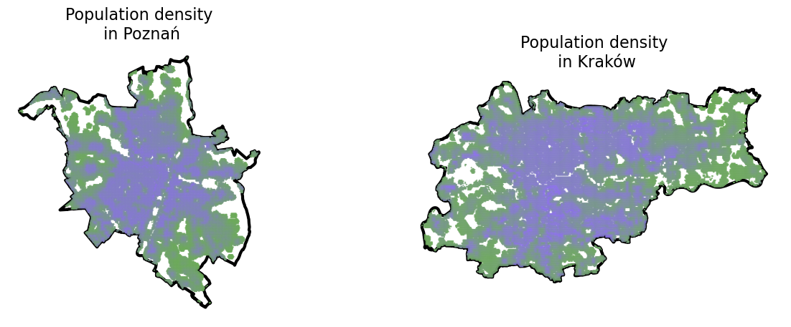
    


### 1.3. Żabka locations 

I will now demonstrate how you can harvest points of interest from Open Street Maps.

#### Kraków


```python
import osmnx as ox
import matplotlib.pyplot as plt
%matplotlib inline
```


```python
city = 'Kraków'
```


```python
krakow_gdf = ox.geocode_to_gdf(city)
krakow_gdf
```


<div>
<style scoped>
    .dataframe tbody tr th:only-of-type {
        vertical-align: middle;
    }

    .dataframe tbody tr th {
        vertical-align: top;
    }

    .dataframe thead th {
        text-align: right;
    }
</style>
<table border="1" class="dataframe">
  <thead>
    <tr style="text-align: right;">
      <th></th>
      <th>geometry</th>
      <th>bbox_north</th>
      <th>bbox_south</th>
      <th>bbox_east</th>
      <th>bbox_west</th>
      <th>place_id</th>
      <th>osm_type</th>
      <th>osm_id</th>
      <th>lat</th>
      <th>lon</th>
      <th>class</th>
      <th>type</th>
      <th>place_rank</th>
      <th>importance</th>
      <th>addresstype</th>
      <th>name</th>
      <th>display_name</th>
    </tr>
  </thead>
  <tbody>
    <tr>
      <th>0</th>
      <td>POLYGON ((19.79224 50.01180, 19.79238 50.01104...</td>
      <td>50.126134</td>
      <td>49.967667</td>
      <td>20.217346</td>
      <td>19.792236</td>
      <td>191790546</td>
      <td>relation</td>
      <td>449696</td>
      <td>50.061947</td>
      <td>19.936856</td>
      <td>boundary</td>
      <td>administrative</td>
      <td>12</td>
      <td>0.69366</td>
      <td>city</td>
      <td>Krakow</td>
      <td>Krakow, Lesser Poland Voivodeship, Poland</td>
    </tr>
  </tbody>
</table>
</div>


```python
shops_krakow = ox.geometries_from_place(
    city,
    tags ={'shop': True}    
)
```


```python
len(shops_krakow)
```


    5801


```python
shops_krakow.columns
```


    Index(['name', 'shop', 'geometry', 'amenity', 'brand', 'brand:wikidata',
           'fuel:GTL_diesel', 'fuel:HGV_diesel', 'fuel:lpg', 'fuel:octane_95',
           ...
           'flower_pot:plastic', 'toilets:access', 'toilets:fee',
           'service:vehicle:painting', 'pastry', 'name:bg', 'room', 'industrial',
           'construction', 'ways'],
          dtype='object', length=366)


```python
shops_krakow
```


<div>
<style scoped>
    .dataframe tbody tr th:only-of-type {
        vertical-align: middle;
    }

    .dataframe tbody tr th {
        vertical-align: top;
    }

    .dataframe thead th {
        text-align: right;
    }
</style>
<table border="1" class="dataframe">
  <thead>
    <tr style="text-align: right;">
      <th></th>
      <th></th>
      <th>name</th>
      <th>shop</th>
      <th>geometry</th>
      <th>amenity</th>
      <th>brand</th>
      <th>brand:wikidata</th>
      <th>fuel:GTL_diesel</th>
      <th>fuel:HGV_diesel</th>
      <th>fuel:lpg</th>
      <th>fuel:octane_95</th>
      <th>...</th>
      <th>flower_pot:plastic</th>
      <th>toilets:access</th>
      <th>toilets:fee</th>
      <th>service:vehicle:painting</th>
      <th>pastry</th>
      <th>name:bg</th>
      <th>room</th>
      <th>industrial</th>
      <th>construction</th>
      <th>ways</th>
    </tr>
    <tr>
      <th>element_type</th>
      <th>osmid</th>
      <th></th>
      <th></th>
      <th></th>
      <th></th>
      <th></th>
      <th></th>
      <th></th>
      <th></th>
      <th></th>
      <th></th>
      <th></th>
      <th></th>
      <th></th>
      <th></th>
      <th></th>
      <th></th>
      <th></th>
      <th></th>
      <th></th>
      <th></th>
      <th></th>
    </tr>
  </thead>
  <tbody>
    <tr>
      <th rowspan="5" valign="top">node</th>
      <th>258234549</th>
      <td>O! Shop</td>
      <td>convenience</td>
      <td>POINT (19.91015 50.07478)</td>
      <td>NaN</td>
      <td>NaN</td>
      <td>NaN</td>
      <td>NaN</td>
      <td>NaN</td>
      <td>NaN</td>
      <td>NaN</td>
      <td>...</td>
      <td>NaN</td>
      <td>NaN</td>
      <td>NaN</td>
      <td>NaN</td>
      <td>NaN</td>
      <td>NaN</td>
      <td>NaN</td>
      <td>NaN</td>
      <td>NaN</td>
      <td>NaN</td>
    </tr>
    <tr>
      <th>277718808</th>
      <td>BP Krakowiak</td>
      <td>convenience</td>
      <td>POINT (19.98509 50.08704)</td>
      <td>fuel</td>
      <td>BP</td>
      <td>Q152057</td>
      <td>yes</td>
      <td>yes</td>
      <td>yes</td>
      <td>yes</td>
      <td>...</td>
      <td>NaN</td>
      <td>NaN</td>
      <td>NaN</td>
      <td>NaN</td>
      <td>NaN</td>
      <td>NaN</td>
      <td>NaN</td>
      <td>NaN</td>
      <td>NaN</td>
      <td>NaN</td>
    </tr>
    <tr>
      <th>287595866</th>
      <td>O! Shop Orlen</td>
      <td>convenience</td>
      <td>POINT (20.00985 50.01074)</td>
      <td>NaN</td>
      <td>PKN Orlen</td>
      <td>NaN</td>
      <td>NaN</td>
      <td>NaN</td>
      <td>NaN</td>
      <td>NaN</td>
      <td>...</td>
      <td>NaN</td>
      <td>NaN</td>
      <td>NaN</td>
      <td>NaN</td>
      <td>NaN</td>
      <td>NaN</td>
      <td>NaN</td>
      <td>NaN</td>
      <td>NaN</td>
      <td>NaN</td>
    </tr>
    <tr>
      <th>472011595</th>
      <td>NaN</td>
      <td>travel_agency</td>
      <td>POINT (19.94485 50.06545)</td>
      <td>NaN</td>
      <td>NaN</td>
      <td>NaN</td>
      <td>NaN</td>
      <td>NaN</td>
      <td>NaN</td>
      <td>NaN</td>
      <td>...</td>
      <td>NaN</td>
      <td>NaN</td>
      <td>NaN</td>
      <td>NaN</td>
      <td>NaN</td>
      <td>NaN</td>
      <td>NaN</td>
      <td>NaN</td>
      <td>NaN</td>
      <td>NaN</td>
    </tr>
    <tr>
      <th>472407933</th>
      <td>Lewiatan Market</td>
      <td>convenience</td>
      <td>POINT (19.96831 50.08802)</td>
      <td>NaN</td>
      <td>NaN</td>
      <td>NaN</td>
      <td>NaN</td>
      <td>NaN</td>
      <td>NaN</td>
      <td>NaN</td>
      <td>...</td>
      <td>NaN</td>
      <td>NaN</td>
      <td>NaN</td>
      <td>NaN</td>
      <td>NaN</td>
      <td>NaN</td>
      <td>NaN</td>
      <td>NaN</td>
      <td>NaN</td>
      <td>NaN</td>
    </tr>
    <tr>
      <th>...</th>
      <th>...</th>
      <td>...</td>
      <td>...</td>
      <td>...</td>
      <td>...</td>
      <td>...</td>
      <td>...</td>
      <td>...</td>
      <td>...</td>
      <td>...</td>
      <td>...</td>
      <td>...</td>
      <td>...</td>
      <td>...</td>
      <td>...</td>
      <td>...</td>
      <td>...</td>
      <td>...</td>
      <td>...</td>
      <td>...</td>
      <td>...</td>
      <td>...</td>
    </tr>
    <tr>
      <th rowspan="4" valign="top">way</th>
      <th>1217141351</th>
      <td>NaN</td>
      <td>vacant</td>
      <td>POLYGON ((19.92802 50.08418, 19.92794 50.08418...</td>
      <td>NaN</td>
      <td>NaN</td>
      <td>NaN</td>
      <td>NaN</td>
      <td>NaN</td>
      <td>NaN</td>
      <td>NaN</td>
      <td>...</td>
      <td>NaN</td>
      <td>NaN</td>
      <td>NaN</td>
      <td>NaN</td>
      <td>NaN</td>
      <td>NaN</td>
      <td>NaN</td>
      <td>NaN</td>
      <td>NaN</td>
      <td>NaN</td>
    </tr>
    <tr>
      <th>1217141352</th>
      <td>NaN</td>
      <td>vacant</td>
      <td>POLYGON ((19.92785 50.08420, 19.92793 50.08420...</td>
      <td>NaN</td>
      <td>NaN</td>
      <td>NaN</td>
      <td>NaN</td>
      <td>NaN</td>
      <td>NaN</td>
      <td>NaN</td>
      <td>...</td>
      <td>NaN</td>
      <td>NaN</td>
      <td>NaN</td>
      <td>NaN</td>
      <td>NaN</td>
      <td>NaN</td>
      <td>NaN</td>
      <td>NaN</td>
      <td>NaN</td>
      <td>NaN</td>
    </tr>
    <tr>
      <th>1217141353</th>
      <td>Kwiaciarnia "Eliza"</td>
      <td>florist</td>
      <td>POLYGON ((19.92780 50.08422, 19.92785 50.08422...</td>
      <td>NaN</td>
      <td>NaN</td>
      <td>NaN</td>
      <td>NaN</td>
      <td>NaN</td>
      <td>NaN</td>
      <td>NaN</td>
      <td>...</td>
      <td>NaN</td>
      <td>NaN</td>
      <td>NaN</td>
      <td>NaN</td>
      <td>NaN</td>
      <td>NaN</td>
      <td>NaN</td>
      <td>NaN</td>
      <td>NaN</td>
      <td>NaN</td>
    </tr>
    <tr>
      <th>1217141357</th>
      <td>Pierogarnia</td>
      <td>frozen_food</td>
      <td>POLYGON ((19.92823 50.08419, 19.92832 50.08419...</td>
      <td>NaN</td>
      <td>NaN</td>
      <td>NaN</td>
      <td>NaN</td>
      <td>NaN</td>
      <td>NaN</td>
      <td>NaN</td>
      <td>...</td>
      <td>NaN</td>
      <td>NaN</td>
      <td>NaN</td>
      <td>NaN</td>
      <td>NaN</td>
      <td>NaN</td>
      <td>NaN</td>
      <td>NaN</td>
      <td>NaN</td>
      <td>NaN</td>
    </tr>
    <tr>
      <th>relation</th>
      <th>2580586</th>
      <td>NaN</td>
      <td>mall</td>
      <td>POLYGON ((19.92803 50.09446, 19.92818 50.09403...</td>
      <td>NaN</td>
      <td>NaN</td>
      <td>NaN</td>
      <td>NaN</td>
      <td>NaN</td>
      <td>NaN</td>
      <td>NaN</td>
      <td>...</td>
      <td>NaN</td>
      <td>NaN</td>
      <td>NaN</td>
      <td>NaN</td>
      <td>NaN</td>
      <td>NaN</td>
      <td>NaN</td>
      <td>NaN</td>
      <td>NaN</td>
      <td>[122219670, 191317442]</td>
    </tr>
  </tbody>
</table>
<p>5801 rows × 366 columns</p>
</div>


So we have information for 5,801 shops located in Kraków. Let's filter our datframe to only include Żabka stores.


```python
zabka_krakow = shops_krakow.query("name == 'Żabka'")
zabka_krakow
```


<div>
<style scoped>
    .dataframe tbody tr th:only-of-type {
        vertical-align: middle;
    }

    .dataframe tbody tr th {
        vertical-align: top;
    }

    .dataframe thead th {
        text-align: right;
    }
</style>
<table border="1" class="dataframe">
  <thead>
    <tr style="text-align: right;">
      <th></th>
      <th></th>
      <th>name</th>
      <th>shop</th>
      <th>geometry</th>
      <th>amenity</th>
      <th>brand</th>
      <th>brand:wikidata</th>
      <th>fuel:GTL_diesel</th>
      <th>fuel:HGV_diesel</th>
      <th>fuel:lpg</th>
      <th>fuel:octane_95</th>
      <th>...</th>
      <th>flower_pot:plastic</th>
      <th>toilets:access</th>
      <th>toilets:fee</th>
      <th>service:vehicle:painting</th>
      <th>pastry</th>
      <th>name:bg</th>
      <th>room</th>
      <th>industrial</th>
      <th>construction</th>
      <th>ways</th>
    </tr>
    <tr>
      <th>element_type</th>
      <th>osmid</th>
      <th></th>
      <th></th>
      <th></th>
      <th></th>
      <th></th>
      <th></th>
      <th></th>
      <th></th>
      <th></th>
      <th></th>
      <th></th>
      <th></th>
      <th></th>
      <th></th>
      <th></th>
      <th></th>
      <th></th>
      <th></th>
      <th></th>
      <th></th>
      <th></th>
    </tr>
  </thead>
  <tbody>
    <tr>
      <th rowspan="5" valign="top">node</th>
      <th>488395425</th>
      <td>Żabka</td>
      <td>convenience</td>
      <td>POINT (19.90927 50.01624)</td>
      <td>NaN</td>
      <td>Żabka</td>
      <td>Q2589061</td>
      <td>NaN</td>
      <td>NaN</td>
      <td>NaN</td>
      <td>NaN</td>
      <td>...</td>
      <td>NaN</td>
      <td>NaN</td>
      <td>NaN</td>
      <td>NaN</td>
      <td>NaN</td>
      <td>NaN</td>
      <td>NaN</td>
      <td>NaN</td>
      <td>NaN</td>
      <td>NaN</td>
    </tr>
    <tr>
      <th>490986192</th>
      <td>Żabka</td>
      <td>convenience</td>
      <td>POINT (19.93876 50.06522)</td>
      <td>NaN</td>
      <td>Żabka</td>
      <td>Q2589061</td>
      <td>NaN</td>
      <td>NaN</td>
      <td>NaN</td>
      <td>NaN</td>
      <td>...</td>
      <td>NaN</td>
      <td>NaN</td>
      <td>NaN</td>
      <td>NaN</td>
      <td>NaN</td>
      <td>NaN</td>
      <td>NaN</td>
      <td>NaN</td>
      <td>NaN</td>
      <td>NaN</td>
    </tr>
    <tr>
      <th>968080349</th>
      <td>Żabka</td>
      <td>convenience</td>
      <td>POINT (20.04779 50.07468)</td>
      <td>NaN</td>
      <td>Żabka</td>
      <td>Q2589061</td>
      <td>NaN</td>
      <td>NaN</td>
      <td>NaN</td>
      <td>NaN</td>
      <td>...</td>
      <td>NaN</td>
      <td>NaN</td>
      <td>NaN</td>
      <td>NaN</td>
      <td>NaN</td>
      <td>NaN</td>
      <td>NaN</td>
      <td>NaN</td>
      <td>NaN</td>
      <td>NaN</td>
    </tr>
    <tr>
      <th>974197831</th>
      <td>Żabka</td>
      <td>convenience</td>
      <td>POINT (19.91498 50.07143)</td>
      <td>NaN</td>
      <td>Żabka</td>
      <td>Q2589061</td>
      <td>NaN</td>
      <td>NaN</td>
      <td>NaN</td>
      <td>NaN</td>
      <td>...</td>
      <td>NaN</td>
      <td>NaN</td>
      <td>NaN</td>
      <td>NaN</td>
      <td>NaN</td>
      <td>NaN</td>
      <td>NaN</td>
      <td>NaN</td>
      <td>NaN</td>
      <td>NaN</td>
    </tr>
    <tr>
      <th>1238620983</th>
      <td>Żabka</td>
      <td>convenience</td>
      <td>POINT (19.92567 50.08687)</td>
      <td>NaN</td>
      <td>Żabka</td>
      <td>Q2589061</td>
      <td>NaN</td>
      <td>NaN</td>
      <td>NaN</td>
      <td>NaN</td>
      <td>...</td>
      <td>NaN</td>
      <td>NaN</td>
      <td>NaN</td>
      <td>NaN</td>
      <td>NaN</td>
      <td>NaN</td>
      <td>NaN</td>
      <td>NaN</td>
      <td>NaN</td>
      <td>NaN</td>
    </tr>
    <tr>
      <th>...</th>
      <th>...</th>
      <td>...</td>
      <td>...</td>
      <td>...</td>
      <td>...</td>
      <td>...</td>
      <td>...</td>
      <td>...</td>
      <td>...</td>
      <td>...</td>
      <td>...</td>
      <td>...</td>
      <td>...</td>
      <td>...</td>
      <td>...</td>
      <td>...</td>
      <td>...</td>
      <td>...</td>
      <td>...</td>
      <td>...</td>
      <td>...</td>
      <td>...</td>
    </tr>
    <tr>
      <th rowspan="5" valign="top">way</th>
      <th>233376345</th>
      <td>Żabka</td>
      <td>convenience</td>
      <td>POLYGON ((19.80859 50.01572, 19.80863 50.01558...</td>
      <td>NaN</td>
      <td>Żabka</td>
      <td>Q2589061</td>
      <td>NaN</td>
      <td>NaN</td>
      <td>NaN</td>
      <td>NaN</td>
      <td>...</td>
      <td>NaN</td>
      <td>NaN</td>
      <td>NaN</td>
      <td>NaN</td>
      <td>NaN</td>
      <td>NaN</td>
      <td>NaN</td>
      <td>NaN</td>
      <td>NaN</td>
      <td>NaN</td>
    </tr>
    <tr>
      <th>276210429</th>
      <td>Żabka</td>
      <td>convenience</td>
      <td>POLYGON ((19.96954 50.08800, 19.96954 50.08799...</td>
      <td>NaN</td>
      <td>Żabka</td>
      <td>Q2589061</td>
      <td>NaN</td>
      <td>NaN</td>
      <td>NaN</td>
      <td>NaN</td>
      <td>...</td>
      <td>NaN</td>
      <td>NaN</td>
      <td>NaN</td>
      <td>NaN</td>
      <td>NaN</td>
      <td>NaN</td>
      <td>NaN</td>
      <td>NaN</td>
      <td>NaN</td>
      <td>NaN</td>
    </tr>
    <tr>
      <th>456751344</th>
      <td>Żabka</td>
      <td>convenience</td>
      <td>POLYGON ((19.91333 50.09743, 19.91331 50.09739...</td>
      <td>NaN</td>
      <td>Żabka</td>
      <td>Q2589061</td>
      <td>NaN</td>
      <td>NaN</td>
      <td>NaN</td>
      <td>NaN</td>
      <td>...</td>
      <td>NaN</td>
      <td>NaN</td>
      <td>NaN</td>
      <td>NaN</td>
      <td>NaN</td>
      <td>NaN</td>
      <td>NaN</td>
      <td>NaN</td>
      <td>NaN</td>
      <td>NaN</td>
    </tr>
    <tr>
      <th>482287217</th>
      <td>Żabka</td>
      <td>convenience</td>
      <td>POLYGON ((19.99688 50.03684, 19.99688 50.03668...</td>
      <td>NaN</td>
      <td>Żabka</td>
      <td>Q2589061</td>
      <td>NaN</td>
      <td>NaN</td>
      <td>NaN</td>
      <td>NaN</td>
      <td>...</td>
      <td>NaN</td>
      <td>NaN</td>
      <td>NaN</td>
      <td>NaN</td>
      <td>NaN</td>
      <td>NaN</td>
      <td>NaN</td>
      <td>NaN</td>
      <td>NaN</td>
      <td>NaN</td>
    </tr>
    <tr>
      <th>1056669395</th>
      <td>Żabka</td>
      <td>convenience</td>
      <td>POLYGON ((19.90594 50.02367, 19.90585 50.02357...</td>
      <td>NaN</td>
      <td>Żabka</td>
      <td>Q2589061</td>
      <td>NaN</td>
      <td>NaN</td>
      <td>NaN</td>
      <td>NaN</td>
      <td>...</td>
      <td>NaN</td>
      <td>NaN</td>
      <td>NaN</td>
      <td>NaN</td>
      <td>NaN</td>
      <td>NaN</td>
      <td>NaN</td>
      <td>NaN</td>
      <td>NaN</td>
      <td>NaN</td>
    </tr>
  </tbody>
</table>
<p>355 rows × 366 columns</p>
</div>


```python
zabka_krakow.info()
```

    <class 'geopandas.geodataframe.GeoDataFrame'>
    MultiIndex: 355 entries, ('node', 488395425) to ('way', 1056669395)
    Columns: 366 entries, name to ways
    dtypes: geometry(1), object(365)
    memory usage: 1.2+ MB


As you can see our dataframe is of type MultiIndex - we have two different element types - `node` (which are the Point geometries) and `way` (which are Polygon geometries). Let's flatten the dataframe by resetting the index :


```python
zabka_krakow= zabka_krakow.reset_index()
zabka_krakow
```


<div>
<style scoped>
    .dataframe tbody tr th:only-of-type {
        vertical-align: middle;
    }

    .dataframe tbody tr th {
        vertical-align: top;
    }

    .dataframe thead th {
        text-align: right;
    }
</style>
<table border="1" class="dataframe">
  <thead>
    <tr style="text-align: right;">
      <th></th>
      <th>element_type</th>
      <th>osmid</th>
      <th>name</th>
      <th>shop</th>
      <th>geometry</th>
      <th>amenity</th>
      <th>brand</th>
      <th>brand:wikidata</th>
      <th>fuel:GTL_diesel</th>
      <th>fuel:HGV_diesel</th>
      <th>...</th>
      <th>flower_pot:plastic</th>
      <th>toilets:access</th>
      <th>toilets:fee</th>
      <th>service:vehicle:painting</th>
      <th>pastry</th>
      <th>name:bg</th>
      <th>room</th>
      <th>industrial</th>
      <th>construction</th>
      <th>ways</th>
    </tr>
  </thead>
  <tbody>
    <tr>
      <th>0</th>
      <td>node</td>
      <td>488395425</td>
      <td>Żabka</td>
      <td>convenience</td>
      <td>POINT (19.90927 50.01624)</td>
      <td>NaN</td>
      <td>Żabka</td>
      <td>Q2589061</td>
      <td>NaN</td>
      <td>NaN</td>
      <td>...</td>
      <td>NaN</td>
      <td>NaN</td>
      <td>NaN</td>
      <td>NaN</td>
      <td>NaN</td>
      <td>NaN</td>
      <td>NaN</td>
      <td>NaN</td>
      <td>NaN</td>
      <td>NaN</td>
    </tr>
    <tr>
      <th>1</th>
      <td>node</td>
      <td>490986192</td>
      <td>Żabka</td>
      <td>convenience</td>
      <td>POINT (19.93876 50.06522)</td>
      <td>NaN</td>
      <td>Żabka</td>
      <td>Q2589061</td>
      <td>NaN</td>
      <td>NaN</td>
      <td>...</td>
      <td>NaN</td>
      <td>NaN</td>
      <td>NaN</td>
      <td>NaN</td>
      <td>NaN</td>
      <td>NaN</td>
      <td>NaN</td>
      <td>NaN</td>
      <td>NaN</td>
      <td>NaN</td>
    </tr>
    <tr>
      <th>2</th>
      <td>node</td>
      <td>968080349</td>
      <td>Żabka</td>
      <td>convenience</td>
      <td>POINT (20.04779 50.07468)</td>
      <td>NaN</td>
      <td>Żabka</td>
      <td>Q2589061</td>
      <td>NaN</td>
      <td>NaN</td>
      <td>...</td>
      <td>NaN</td>
      <td>NaN</td>
      <td>NaN</td>
      <td>NaN</td>
      <td>NaN</td>
      <td>NaN</td>
      <td>NaN</td>
      <td>NaN</td>
      <td>NaN</td>
      <td>NaN</td>
    </tr>
    <tr>
      <th>3</th>
      <td>node</td>
      <td>974197831</td>
      <td>Żabka</td>
      <td>convenience</td>
      <td>POINT (19.91498 50.07143)</td>
      <td>NaN</td>
      <td>Żabka</td>
      <td>Q2589061</td>
      <td>NaN</td>
      <td>NaN</td>
      <td>...</td>
      <td>NaN</td>
      <td>NaN</td>
      <td>NaN</td>
      <td>NaN</td>
      <td>NaN</td>
      <td>NaN</td>
      <td>NaN</td>
      <td>NaN</td>
      <td>NaN</td>
      <td>NaN</td>
    </tr>
    <tr>
      <th>4</th>
      <td>node</td>
      <td>1238620983</td>
      <td>Żabka</td>
      <td>convenience</td>
      <td>POINT (19.92567 50.08687)</td>
      <td>NaN</td>
      <td>Żabka</td>
      <td>Q2589061</td>
      <td>NaN</td>
      <td>NaN</td>
      <td>...</td>
      <td>NaN</td>
      <td>NaN</td>
      <td>NaN</td>
      <td>NaN</td>
      <td>NaN</td>
      <td>NaN</td>
      <td>NaN</td>
      <td>NaN</td>
      <td>NaN</td>
      <td>NaN</td>
    </tr>
    <tr>
      <th>...</th>
      <td>...</td>
      <td>...</td>
      <td>...</td>
      <td>...</td>
      <td>...</td>
      <td>...</td>
      <td>...</td>
      <td>...</td>
      <td>...</td>
      <td>...</td>
      <td>...</td>
      <td>...</td>
      <td>...</td>
      <td>...</td>
      <td>...</td>
      <td>...</td>
      <td>...</td>
      <td>...</td>
      <td>...</td>
      <td>...</td>
      <td>...</td>
    </tr>
    <tr>
      <th>350</th>
      <td>way</td>
      <td>233376345</td>
      <td>Żabka</td>
      <td>convenience</td>
      <td>POLYGON ((19.80859 50.01572, 19.80863 50.01558...</td>
      <td>NaN</td>
      <td>Żabka</td>
      <td>Q2589061</td>
      <td>NaN</td>
      <td>NaN</td>
      <td>...</td>
      <td>NaN</td>
      <td>NaN</td>
      <td>NaN</td>
      <td>NaN</td>
      <td>NaN</td>
      <td>NaN</td>
      <td>NaN</td>
      <td>NaN</td>
      <td>NaN</td>
      <td>NaN</td>
    </tr>
    <tr>
      <th>351</th>
      <td>way</td>
      <td>276210429</td>
      <td>Żabka</td>
      <td>convenience</td>
      <td>POLYGON ((19.96954 50.08800, 19.96954 50.08799...</td>
      <td>NaN</td>
      <td>Żabka</td>
      <td>Q2589061</td>
      <td>NaN</td>
      <td>NaN</td>
      <td>...</td>
      <td>NaN</td>
      <td>NaN</td>
      <td>NaN</td>
      <td>NaN</td>
      <td>NaN</td>
      <td>NaN</td>
      <td>NaN</td>
      <td>NaN</td>
      <td>NaN</td>
      <td>NaN</td>
    </tr>
    <tr>
      <th>352</th>
      <td>way</td>
      <td>456751344</td>
      <td>Żabka</td>
      <td>convenience</td>
      <td>POLYGON ((19.91333 50.09743, 19.91331 50.09739...</td>
      <td>NaN</td>
      <td>Żabka</td>
      <td>Q2589061</td>
      <td>NaN</td>
      <td>NaN</td>
      <td>...</td>
      <td>NaN</td>
      <td>NaN</td>
      <td>NaN</td>
      <td>NaN</td>
      <td>NaN</td>
      <td>NaN</td>
      <td>NaN</td>
      <td>NaN</td>
      <td>NaN</td>
      <td>NaN</td>
    </tr>
    <tr>
      <th>353</th>
      <td>way</td>
      <td>482287217</td>
      <td>Żabka</td>
      <td>convenience</td>
      <td>POLYGON ((19.99688 50.03684, 19.99688 50.03668...</td>
      <td>NaN</td>
      <td>Żabka</td>
      <td>Q2589061</td>
      <td>NaN</td>
      <td>NaN</td>
      <td>...</td>
      <td>NaN</td>
      <td>NaN</td>
      <td>NaN</td>
      <td>NaN</td>
      <td>NaN</td>
      <td>NaN</td>
      <td>NaN</td>
      <td>NaN</td>
      <td>NaN</td>
      <td>NaN</td>
    </tr>
    <tr>
      <th>354</th>
      <td>way</td>
      <td>1056669395</td>
      <td>Żabka</td>
      <td>convenience</td>
      <td>POLYGON ((19.90594 50.02367, 19.90585 50.02357...</td>
      <td>NaN</td>
      <td>Żabka</td>
      <td>Q2589061</td>
      <td>NaN</td>
      <td>NaN</td>
      <td>...</td>
      <td>NaN</td>
      <td>NaN</td>
      <td>NaN</td>
      <td>NaN</td>
      <td>NaN</td>
      <td>NaN</td>
      <td>NaN</td>
      <td>NaN</td>
      <td>NaN</td>
      <td>NaN</td>
    </tr>
  </tbody>
</table>
<p>355 rows × 368 columns</p>
</div>


And filter to only include the nodes, which are the point locations of the Żabka stores :


```python
zabka_krakow = zabka_krakow.query("element_type== 'node'")
zabka_krakow
```


<div>
<style scoped>
    .dataframe tbody tr th:only-of-type {
        vertical-align: middle;
    }

    .dataframe tbody tr th {
        vertical-align: top;
    }

    .dataframe thead th {
        text-align: right;
    }
</style>
<table border="1" class="dataframe">
  <thead>
    <tr style="text-align: right;">
      <th></th>
      <th>element_type</th>
      <th>osmid</th>
      <th>name</th>
      <th>shop</th>
      <th>geometry</th>
      <th>amenity</th>
      <th>brand</th>
      <th>brand:wikidata</th>
      <th>fuel:GTL_diesel</th>
      <th>fuel:HGV_diesel</th>
      <th>...</th>
      <th>flower_pot:plastic</th>
      <th>toilets:access</th>
      <th>toilets:fee</th>
      <th>service:vehicle:painting</th>
      <th>pastry</th>
      <th>name:bg</th>
      <th>room</th>
      <th>industrial</th>
      <th>construction</th>
      <th>ways</th>
    </tr>
  </thead>
  <tbody>
    <tr>
      <th>0</th>
      <td>node</td>
      <td>488395425</td>
      <td>Żabka</td>
      <td>convenience</td>
      <td>POINT (19.90927 50.01624)</td>
      <td>NaN</td>
      <td>Żabka</td>
      <td>Q2589061</td>
      <td>NaN</td>
      <td>NaN</td>
      <td>...</td>
      <td>NaN</td>
      <td>NaN</td>
      <td>NaN</td>
      <td>NaN</td>
      <td>NaN</td>
      <td>NaN</td>
      <td>NaN</td>
      <td>NaN</td>
      <td>NaN</td>
      <td>NaN</td>
    </tr>
    <tr>
      <th>1</th>
      <td>node</td>
      <td>490986192</td>
      <td>Żabka</td>
      <td>convenience</td>
      <td>POINT (19.93876 50.06522)</td>
      <td>NaN</td>
      <td>Żabka</td>
      <td>Q2589061</td>
      <td>NaN</td>
      <td>NaN</td>
      <td>...</td>
      <td>NaN</td>
      <td>NaN</td>
      <td>NaN</td>
      <td>NaN</td>
      <td>NaN</td>
      <td>NaN</td>
      <td>NaN</td>
      <td>NaN</td>
      <td>NaN</td>
      <td>NaN</td>
    </tr>
    <tr>
      <th>2</th>
      <td>node</td>
      <td>968080349</td>
      <td>Żabka</td>
      <td>convenience</td>
      <td>POINT (20.04779 50.07468)</td>
      <td>NaN</td>
      <td>Żabka</td>
      <td>Q2589061</td>
      <td>NaN</td>
      <td>NaN</td>
      <td>...</td>
      <td>NaN</td>
      <td>NaN</td>
      <td>NaN</td>
      <td>NaN</td>
      <td>NaN</td>
      <td>NaN</td>
      <td>NaN</td>
      <td>NaN</td>
      <td>NaN</td>
      <td>NaN</td>
    </tr>
    <tr>
      <th>3</th>
      <td>node</td>
      <td>974197831</td>
      <td>Żabka</td>
      <td>convenience</td>
      <td>POINT (19.91498 50.07143)</td>
      <td>NaN</td>
      <td>Żabka</td>
      <td>Q2589061</td>
      <td>NaN</td>
      <td>NaN</td>
      <td>...</td>
      <td>NaN</td>
      <td>NaN</td>
      <td>NaN</td>
      <td>NaN</td>
      <td>NaN</td>
      <td>NaN</td>
      <td>NaN</td>
      <td>NaN</td>
      <td>NaN</td>
      <td>NaN</td>
    </tr>
    <tr>
      <th>4</th>
      <td>node</td>
      <td>1238620983</td>
      <td>Żabka</td>
      <td>convenience</td>
      <td>POINT (19.92567 50.08687)</td>
      <td>NaN</td>
      <td>Żabka</td>
      <td>Q2589061</td>
      <td>NaN</td>
      <td>NaN</td>
      <td>...</td>
      <td>NaN</td>
      <td>NaN</td>
      <td>NaN</td>
      <td>NaN</td>
      <td>NaN</td>
      <td>NaN</td>
      <td>NaN</td>
      <td>NaN</td>
      <td>NaN</td>
      <td>NaN</td>
    </tr>
    <tr>
      <th>...</th>
      <td>...</td>
      <td>...</td>
      <td>...</td>
      <td>...</td>
      <td>...</td>
      <td>...</td>
      <td>...</td>
      <td>...</td>
      <td>...</td>
      <td>...</td>
      <td>...</td>
      <td>...</td>
      <td>...</td>
      <td>...</td>
      <td>...</td>
      <td>...</td>
      <td>...</td>
      <td>...</td>
      <td>...</td>
      <td>...</td>
      <td>...</td>
    </tr>
    <tr>
      <th>342</th>
      <td>node</td>
      <td>11210253666</td>
      <td>Żabka</td>
      <td>convenience</td>
      <td>POINT (19.99334 50.04130)</td>
      <td>NaN</td>
      <td>Żabka</td>
      <td>Q2589061</td>
      <td>NaN</td>
      <td>NaN</td>
      <td>...</td>
      <td>NaN</td>
      <td>NaN</td>
      <td>NaN</td>
      <td>NaN</td>
      <td>NaN</td>
      <td>NaN</td>
      <td>NaN</td>
      <td>NaN</td>
      <td>NaN</td>
      <td>NaN</td>
    </tr>
    <tr>
      <th>343</th>
      <td>node</td>
      <td>11242237732</td>
      <td>Żabka</td>
      <td>convenience</td>
      <td>POINT (19.96528 50.03975)</td>
      <td>NaN</td>
      <td>Żabka</td>
      <td>Q2589061</td>
      <td>NaN</td>
      <td>NaN</td>
      <td>...</td>
      <td>NaN</td>
      <td>NaN</td>
      <td>NaN</td>
      <td>NaN</td>
      <td>NaN</td>
      <td>NaN</td>
      <td>NaN</td>
      <td>NaN</td>
      <td>NaN</td>
      <td>NaN</td>
    </tr>
    <tr>
      <th>344</th>
      <td>node</td>
      <td>11283874924</td>
      <td>Żabka</td>
      <td>convenience</td>
      <td>POINT (20.02094 50.08485)</td>
      <td>NaN</td>
      <td>Żabka</td>
      <td>Q2589061</td>
      <td>NaN</td>
      <td>NaN</td>
      <td>...</td>
      <td>NaN</td>
      <td>NaN</td>
      <td>NaN</td>
      <td>NaN</td>
      <td>NaN</td>
      <td>NaN</td>
      <td>NaN</td>
      <td>NaN</td>
      <td>NaN</td>
      <td>NaN</td>
    </tr>
    <tr>
      <th>345</th>
      <td>node</td>
      <td>11298496372</td>
      <td>Żabka</td>
      <td>convenience</td>
      <td>POINT (19.89958 50.07252)</td>
      <td>NaN</td>
      <td>Żabka</td>
      <td>Q2589061</td>
      <td>NaN</td>
      <td>NaN</td>
      <td>...</td>
      <td>NaN</td>
      <td>NaN</td>
      <td>NaN</td>
      <td>NaN</td>
      <td>NaN</td>
      <td>NaN</td>
      <td>NaN</td>
      <td>NaN</td>
      <td>NaN</td>
      <td>NaN</td>
    </tr>
    <tr>
      <th>346</th>
      <td>node</td>
      <td>11317208173</td>
      <td>Żabka</td>
      <td>convenience</td>
      <td>POINT (19.89228 49.99764)</td>
      <td>NaN</td>
      <td>Żabka</td>
      <td>Q2589061</td>
      <td>NaN</td>
      <td>NaN</td>
      <td>...</td>
      <td>NaN</td>
      <td>NaN</td>
      <td>NaN</td>
      <td>NaN</td>
      <td>NaN</td>
      <td>NaN</td>
      <td>NaN</td>
      <td>NaN</td>
      <td>NaN</td>
      <td>NaN</td>
    </tr>
  </tbody>
</table>
<p>347 rows × 368 columns</p>
</div>


So we now have the locations of 347 stores in Kraków. We can plot them in one line of code :


```python
zabka_krakow.plot()
```

    
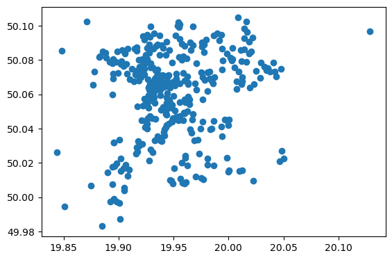
    


Let's save our geodatframe to a geoJSON file : 


```python
# Specify the output file path and name
output_file = 'zabka_kraków.geojson'

# Save the GeoDataFrame as a GeoJSON file
zabka_krakow.to_file(output_file, driver='GeoJSON')
```

#### Żabka locations - Poznań

We simply repeat the process for Poznań : 


```python
city = 'Poznań'
```


```python
poznan_gdf = ox.geocode_to_gdf(city)
poznan_gdf
```


<div>
<style scoped>
    .dataframe tbody tr th:only-of-type {
        vertical-align: middle;
    }

    .dataframe tbody tr th {
        vertical-align: top;
    }

    .dataframe thead th {
        text-align: right;
    }
</style>
<table border="1" class="dataframe">
  <thead>
    <tr style="text-align: right;">
      <th></th>
      <th>geometry</th>
      <th>bbox_north</th>
      <th>bbox_south</th>
      <th>bbox_east</th>
      <th>bbox_west</th>
      <th>place_id</th>
      <th>osm_type</th>
      <th>osm_id</th>
      <th>lat</th>
      <th>lon</th>
      <th>class</th>
      <th>type</th>
      <th>place_rank</th>
      <th>importance</th>
      <th>addresstype</th>
      <th>name</th>
      <th>display_name</th>
    </tr>
  </thead>
  <tbody>
    <tr>
      <th>0</th>
      <td>POLYGON ((16.73159 52.46375, 16.73162 52.46365...</td>
      <td>52.509328</td>
      <td>52.291924</td>
      <td>17.071707</td>
      <td>16.731588</td>
      <td>187624076</td>
      <td>relation</td>
      <td>2456294</td>
      <td>52.408266</td>
      <td>16.93352</td>
      <td>boundary</td>
      <td>administrative</td>
      <td>12</td>
      <td>0.664541</td>
      <td>city</td>
      <td>Poznań</td>
      <td>Poznań, Greater Poland Voivodeship, Poland</td>
    </tr>
  </tbody>
</table>
</div>


```python
shops_poznan = ox.geometries_from_place(
    city,
    tags ={'shop': True}    
)
```

    /tmp/ipykernel_552/1581214074.py:1: UserWarning: The `geometries` module and `geometries_from_X` functions have been renamed the `features` module and `features_from_X` functions. Use these instead. The `geometries` module and function names are deprecated and will be removed in a future release.
      shops_poznan = ox.geometries_from_place(


```python
len(shops_poznan)
```


    3671


```python
zabka_poznan= shops_poznan.query("name == 'Żabka'")
zabka_poznan
```


<div>
<style scoped>
    .dataframe tbody tr th:only-of-type {
        vertical-align: middle;
    }

    .dataframe tbody tr th {
        vertical-align: top;
    }

    .dataframe thead th {
        text-align: right;
    }
</style>
<table border="1" class="dataframe">
  <thead>
    <tr style="text-align: right;">
      <th></th>
      <th></th>
      <th>amenity</th>
      <th>brand</th>
      <th>fuel:diesel</th>
      <th>fuel:lpg</th>
      <th>fuel:octane_95</th>
      <th>fuel:octane_98</th>
      <th>name</th>
      <th>opening_hours</th>
      <th>payment:credit_cards</th>
      <th>payment:dkv</th>
      <th>...</th>
      <th>fuel:firewood</th>
      <th>service:vehicle:oil</th>
      <th>service:vehicle:geometry</th>
      <th>service:vehicle:glass</th>
      <th>service:vehicle:suspension</th>
      <th>construction:start_date</th>
      <th>level_name</th>
      <th>service:vehicle:electrical</th>
      <th>ways</th>
      <th>type</th>
    </tr>
    <tr>
      <th>element_type</th>
      <th>osmid</th>
      <th></th>
      <th></th>
      <th></th>
      <th></th>
      <th></th>
      <th></th>
      <th></th>
      <th></th>
      <th></th>
      <th></th>
      <th></th>
      <th></th>
      <th></th>
      <th></th>
      <th></th>
      <th></th>
      <th></th>
      <th></th>
      <th></th>
      <th></th>
      <th></th>
    </tr>
  </thead>
  <tbody>
    <tr>
      <th rowspan="5" valign="top">node</th>
      <th>430724948</th>
      <td>NaN</td>
      <td>Żabka</td>
      <td>NaN</td>
      <td>NaN</td>
      <td>NaN</td>
      <td>NaN</td>
      <td>Żabka</td>
      <td>NaN</td>
      <td>NaN</td>
      <td>NaN</td>
      <td>...</td>
      <td>NaN</td>
      <td>NaN</td>
      <td>NaN</td>
      <td>NaN</td>
      <td>NaN</td>
      <td>NaN</td>
      <td>NaN</td>
      <td>NaN</td>
      <td>NaN</td>
      <td>NaN</td>
    </tr>
    <tr>
      <th>430999602</th>
      <td>NaN</td>
      <td>Żabka</td>
      <td>NaN</td>
      <td>NaN</td>
      <td>NaN</td>
      <td>NaN</td>
      <td>Żabka</td>
      <td>Mo-Su 06:00-23:00</td>
      <td>NaN</td>
      <td>NaN</td>
      <td>...</td>
      <td>NaN</td>
      <td>NaN</td>
      <td>NaN</td>
      <td>NaN</td>
      <td>NaN</td>
      <td>NaN</td>
      <td>NaN</td>
      <td>NaN</td>
      <td>NaN</td>
      <td>NaN</td>
    </tr>
    <tr>
      <th>431337246</th>
      <td>NaN</td>
      <td>Żabka</td>
      <td>NaN</td>
      <td>NaN</td>
      <td>NaN</td>
      <td>NaN</td>
      <td>Żabka</td>
      <td>Mo-Su 06:00-23:00</td>
      <td>NaN</td>
      <td>NaN</td>
      <td>...</td>
      <td>NaN</td>
      <td>NaN</td>
      <td>NaN</td>
      <td>NaN</td>
      <td>NaN</td>
      <td>NaN</td>
      <td>NaN</td>
      <td>NaN</td>
      <td>NaN</td>
      <td>NaN</td>
    </tr>
    <tr>
      <th>431337328</th>
      <td>NaN</td>
      <td>Żabka</td>
      <td>NaN</td>
      <td>NaN</td>
      <td>NaN</td>
      <td>NaN</td>
      <td>Żabka</td>
      <td>Mo-Su 06:00-23:00</td>
      <td>NaN</td>
      <td>NaN</td>
      <td>...</td>
      <td>NaN</td>
      <td>NaN</td>
      <td>NaN</td>
      <td>NaN</td>
      <td>NaN</td>
      <td>NaN</td>
      <td>NaN</td>
      <td>NaN</td>
      <td>NaN</td>
      <td>NaN</td>
    </tr>
    <tr>
      <th>431913532</th>
      <td>NaN</td>
      <td>Żabka</td>
      <td>NaN</td>
      <td>NaN</td>
      <td>NaN</td>
      <td>NaN</td>
      <td>Żabka</td>
      <td>Mo-Su 06:00-23:00</td>
      <td>NaN</td>
      <td>NaN</td>
      <td>...</td>
      <td>NaN</td>
      <td>NaN</td>
      <td>NaN</td>
      <td>NaN</td>
      <td>NaN</td>
      <td>NaN</td>
      <td>NaN</td>
      <td>NaN</td>
      <td>NaN</td>
      <td>NaN</td>
    </tr>
    <tr>
      <th>...</th>
      <th>...</th>
      <td>...</td>
      <td>...</td>
      <td>...</td>
      <td>...</td>
      <td>...</td>
      <td>...</td>
      <td>...</td>
      <td>...</td>
      <td>...</td>
      <td>...</td>
      <td>...</td>
      <td>...</td>
      <td>...</td>
      <td>...</td>
      <td>...</td>
      <td>...</td>
      <td>...</td>
      <td>...</td>
      <td>...</td>
      <td>...</td>
      <td>...</td>
    </tr>
    <tr>
      <th rowspan="5" valign="top">way</th>
      <th>484409230</th>
      <td>NaN</td>
      <td>NaN</td>
      <td>NaN</td>
      <td>NaN</td>
      <td>NaN</td>
      <td>NaN</td>
      <td>Żabka</td>
      <td>Mo-Sa 06:00-23:00; Su 11:00-20:00</td>
      <td>NaN</td>
      <td>NaN</td>
      <td>...</td>
      <td>NaN</td>
      <td>NaN</td>
      <td>NaN</td>
      <td>NaN</td>
      <td>NaN</td>
      <td>NaN</td>
      <td>NaN</td>
      <td>NaN</td>
      <td>NaN</td>
      <td>NaN</td>
    </tr>
    <tr>
      <th>491283918</th>
      <td>NaN</td>
      <td>Żabka</td>
      <td>NaN</td>
      <td>NaN</td>
      <td>NaN</td>
      <td>NaN</td>
      <td>Żabka</td>
      <td>Mo-Su 06:00-23:00</td>
      <td>NaN</td>
      <td>NaN</td>
      <td>...</td>
      <td>NaN</td>
      <td>NaN</td>
      <td>NaN</td>
      <td>NaN</td>
      <td>NaN</td>
      <td>NaN</td>
      <td>NaN</td>
      <td>NaN</td>
      <td>NaN</td>
      <td>NaN</td>
    </tr>
    <tr>
      <th>492281557</th>
      <td>NaN</td>
      <td>NaN</td>
      <td>NaN</td>
      <td>NaN</td>
      <td>NaN</td>
      <td>NaN</td>
      <td>Żabka</td>
      <td>NaN</td>
      <td>NaN</td>
      <td>NaN</td>
      <td>...</td>
      <td>NaN</td>
      <td>NaN</td>
      <td>NaN</td>
      <td>NaN</td>
      <td>NaN</td>
      <td>NaN</td>
      <td>NaN</td>
      <td>NaN</td>
      <td>NaN</td>
      <td>NaN</td>
    </tr>
    <tr>
      <th>576088500</th>
      <td>NaN</td>
      <td>Żabka</td>
      <td>NaN</td>
      <td>NaN</td>
      <td>NaN</td>
      <td>NaN</td>
      <td>Żabka</td>
      <td>Mo-Su 06:00-23:00</td>
      <td>NaN</td>
      <td>NaN</td>
      <td>...</td>
      <td>NaN</td>
      <td>NaN</td>
      <td>NaN</td>
      <td>NaN</td>
      <td>NaN</td>
      <td>NaN</td>
      <td>NaN</td>
      <td>NaN</td>
      <td>NaN</td>
      <td>NaN</td>
    </tr>
    <tr>
      <th>607697313</th>
      <td>NaN</td>
      <td>Żabka</td>
      <td>NaN</td>
      <td>NaN</td>
      <td>NaN</td>
      <td>NaN</td>
      <td>Żabka</td>
      <td>Mo-Su 06:00-23:00</td>
      <td>NaN</td>
      <td>NaN</td>
      <td>...</td>
      <td>NaN</td>
      <td>NaN</td>
      <td>NaN</td>
      <td>NaN</td>
      <td>NaN</td>
      <td>NaN</td>
      <td>NaN</td>
      <td>NaN</td>
      <td>NaN</td>
      <td>NaN</td>
    </tr>
  </tbody>
</table>
<p>245 rows × 313 columns</p>
</div>


```python
zabka_poznan = zabka_poznan.reset_index()
zabka_poznan
```


<div>
<style scoped>
    .dataframe tbody tr th:only-of-type {
        vertical-align: middle;
    }

    .dataframe tbody tr th {
        vertical-align: top;
    }

    .dataframe thead th {
        text-align: right;
    }
</style>
<table border="1" class="dataframe">
  <thead>
    <tr style="text-align: right;">
      <th></th>
      <th>element_type</th>
      <th>osmid</th>
      <th>amenity</th>
      <th>brand</th>
      <th>fuel:diesel</th>
      <th>fuel:lpg</th>
      <th>fuel:octane_95</th>
      <th>fuel:octane_98</th>
      <th>name</th>
      <th>opening_hours</th>
      <th>...</th>
      <th>fuel:firewood</th>
      <th>service:vehicle:oil</th>
      <th>service:vehicle:geometry</th>
      <th>service:vehicle:glass</th>
      <th>service:vehicle:suspension</th>
      <th>construction:start_date</th>
      <th>level_name</th>
      <th>service:vehicle:electrical</th>
      <th>ways</th>
      <th>type</th>
    </tr>
  </thead>
  <tbody>
    <tr>
      <th>0</th>
      <td>node</td>
      <td>430724948</td>
      <td>NaN</td>
      <td>Żabka</td>
      <td>NaN</td>
      <td>NaN</td>
      <td>NaN</td>
      <td>NaN</td>
      <td>Żabka</td>
      <td>NaN</td>
      <td>...</td>
      <td>NaN</td>
      <td>NaN</td>
      <td>NaN</td>
      <td>NaN</td>
      <td>NaN</td>
      <td>NaN</td>
      <td>NaN</td>
      <td>NaN</td>
      <td>NaN</td>
      <td>NaN</td>
    </tr>
    <tr>
      <th>1</th>
      <td>node</td>
      <td>430999602</td>
      <td>NaN</td>
      <td>Żabka</td>
      <td>NaN</td>
      <td>NaN</td>
      <td>NaN</td>
      <td>NaN</td>
      <td>Żabka</td>
      <td>Mo-Su 06:00-23:00</td>
      <td>...</td>
      <td>NaN</td>
      <td>NaN</td>
      <td>NaN</td>
      <td>NaN</td>
      <td>NaN</td>
      <td>NaN</td>
      <td>NaN</td>
      <td>NaN</td>
      <td>NaN</td>
      <td>NaN</td>
    </tr>
    <tr>
      <th>2</th>
      <td>node</td>
      <td>431337246</td>
      <td>NaN</td>
      <td>Żabka</td>
      <td>NaN</td>
      <td>NaN</td>
      <td>NaN</td>
      <td>NaN</td>
      <td>Żabka</td>
      <td>Mo-Su 06:00-23:00</td>
      <td>...</td>
      <td>NaN</td>
      <td>NaN</td>
      <td>NaN</td>
      <td>NaN</td>
      <td>NaN</td>
      <td>NaN</td>
      <td>NaN</td>
      <td>NaN</td>
      <td>NaN</td>
      <td>NaN</td>
    </tr>
    <tr>
      <th>3</th>
      <td>node</td>
      <td>431337328</td>
      <td>NaN</td>
      <td>Żabka</td>
      <td>NaN</td>
      <td>NaN</td>
      <td>NaN</td>
      <td>NaN</td>
      <td>Żabka</td>
      <td>Mo-Su 06:00-23:00</td>
      <td>...</td>
      <td>NaN</td>
      <td>NaN</td>
      <td>NaN</td>
      <td>NaN</td>
      <td>NaN</td>
      <td>NaN</td>
      <td>NaN</td>
      <td>NaN</td>
      <td>NaN</td>
      <td>NaN</td>
    </tr>
    <tr>
      <th>4</th>
      <td>node</td>
      <td>431913532</td>
      <td>NaN</td>
      <td>Żabka</td>
      <td>NaN</td>
      <td>NaN</td>
      <td>NaN</td>
      <td>NaN</td>
      <td>Żabka</td>
      <td>Mo-Su 06:00-23:00</td>
      <td>...</td>
      <td>NaN</td>
      <td>NaN</td>
      <td>NaN</td>
      <td>NaN</td>
      <td>NaN</td>
      <td>NaN</td>
      <td>NaN</td>
      <td>NaN</td>
      <td>NaN</td>
      <td>NaN</td>
    </tr>
    <tr>
      <th>...</th>
      <td>...</td>
      <td>...</td>
      <td>...</td>
      <td>...</td>
      <td>...</td>
      <td>...</td>
      <td>...</td>
      <td>...</td>
      <td>...</td>
      <td>...</td>
      <td>...</td>
      <td>...</td>
      <td>...</td>
      <td>...</td>
      <td>...</td>
      <td>...</td>
      <td>...</td>
      <td>...</td>
      <td>...</td>
      <td>...</td>
      <td>...</td>
    </tr>
    <tr>
      <th>240</th>
      <td>way</td>
      <td>484409230</td>
      <td>NaN</td>
      <td>NaN</td>
      <td>NaN</td>
      <td>NaN</td>
      <td>NaN</td>
      <td>NaN</td>
      <td>Żabka</td>
      <td>Mo-Sa 06:00-23:00; Su 11:00-20:00</td>
      <td>...</td>
      <td>NaN</td>
      <td>NaN</td>
      <td>NaN</td>
      <td>NaN</td>
      <td>NaN</td>
      <td>NaN</td>
      <td>NaN</td>
      <td>NaN</td>
      <td>NaN</td>
      <td>NaN</td>
    </tr>
    <tr>
      <th>241</th>
      <td>way</td>
      <td>491283918</td>
      <td>NaN</td>
      <td>Żabka</td>
      <td>NaN</td>
      <td>NaN</td>
      <td>NaN</td>
      <td>NaN</td>
      <td>Żabka</td>
      <td>Mo-Su 06:00-23:00</td>
      <td>...</td>
      <td>NaN</td>
      <td>NaN</td>
      <td>NaN</td>
      <td>NaN</td>
      <td>NaN</td>
      <td>NaN</td>
      <td>NaN</td>
      <td>NaN</td>
      <td>NaN</td>
      <td>NaN</td>
    </tr>
    <tr>
      <th>242</th>
      <td>way</td>
      <td>492281557</td>
      <td>NaN</td>
      <td>NaN</td>
      <td>NaN</td>
      <td>NaN</td>
      <td>NaN</td>
      <td>NaN</td>
      <td>Żabka</td>
      <td>NaN</td>
      <td>...</td>
      <td>NaN</td>
      <td>NaN</td>
      <td>NaN</td>
      <td>NaN</td>
      <td>NaN</td>
      <td>NaN</td>
      <td>NaN</td>
      <td>NaN</td>
      <td>NaN</td>
      <td>NaN</td>
    </tr>
    <tr>
      <th>243</th>
      <td>way</td>
      <td>576088500</td>
      <td>NaN</td>
      <td>Żabka</td>
      <td>NaN</td>
      <td>NaN</td>
      <td>NaN</td>
      <td>NaN</td>
      <td>Żabka</td>
      <td>Mo-Su 06:00-23:00</td>
      <td>...</td>
      <td>NaN</td>
      <td>NaN</td>
      <td>NaN</td>
      <td>NaN</td>
      <td>NaN</td>
      <td>NaN</td>
      <td>NaN</td>
      <td>NaN</td>
      <td>NaN</td>
      <td>NaN</td>
    </tr>
    <tr>
      <th>244</th>
      <td>way</td>
      <td>607697313</td>
      <td>NaN</td>
      <td>Żabka</td>
      <td>NaN</td>
      <td>NaN</td>
      <td>NaN</td>
      <td>NaN</td>
      <td>Żabka</td>
      <td>Mo-Su 06:00-23:00</td>
      <td>...</td>
      <td>NaN</td>
      <td>NaN</td>
      <td>NaN</td>
      <td>NaN</td>
      <td>NaN</td>
      <td>NaN</td>
      <td>NaN</td>
      <td>NaN</td>
      <td>NaN</td>
      <td>NaN</td>
    </tr>
  </tbody>
</table>
<p>245 rows × 315 columns</p>
</div>


```python
zabka_poznan = zabka_poznan.query("element_type== 'node'")
zabka_poznan
```


<div>
<style scoped>
    .dataframe tbody tr th:only-of-type {
        vertical-align: middle;
    }

    .dataframe tbody tr th {
        vertical-align: top;
    }

    .dataframe thead th {
        text-align: right;
    }
</style>
<table border="1" class="dataframe">
  <thead>
    <tr style="text-align: right;">
      <th></th>
      <th>element_type</th>
      <th>osmid</th>
      <th>amenity</th>
      <th>brand</th>
      <th>fuel:diesel</th>
      <th>fuel:lpg</th>
      <th>fuel:octane_95</th>
      <th>fuel:octane_98</th>
      <th>name</th>
      <th>opening_hours</th>
      <th>...</th>
      <th>fuel:firewood</th>
      <th>service:vehicle:oil</th>
      <th>service:vehicle:geometry</th>
      <th>service:vehicle:glass</th>
      <th>service:vehicle:suspension</th>
      <th>construction:start_date</th>
      <th>level_name</th>
      <th>service:vehicle:electrical</th>
      <th>ways</th>
      <th>type</th>
    </tr>
  </thead>
  <tbody>
    <tr>
      <th>0</th>
      <td>node</td>
      <td>430724948</td>
      <td>NaN</td>
      <td>Żabka</td>
      <td>NaN</td>
      <td>NaN</td>
      <td>NaN</td>
      <td>NaN</td>
      <td>Żabka</td>
      <td>NaN</td>
      <td>...</td>
      <td>NaN</td>
      <td>NaN</td>
      <td>NaN</td>
      <td>NaN</td>
      <td>NaN</td>
      <td>NaN</td>
      <td>NaN</td>
      <td>NaN</td>
      <td>NaN</td>
      <td>NaN</td>
    </tr>
    <tr>
      <th>1</th>
      <td>node</td>
      <td>430999602</td>
      <td>NaN</td>
      <td>Żabka</td>
      <td>NaN</td>
      <td>NaN</td>
      <td>NaN</td>
      <td>NaN</td>
      <td>Żabka</td>
      <td>Mo-Su 06:00-23:00</td>
      <td>...</td>
      <td>NaN</td>
      <td>NaN</td>
      <td>NaN</td>
      <td>NaN</td>
      <td>NaN</td>
      <td>NaN</td>
      <td>NaN</td>
      <td>NaN</td>
      <td>NaN</td>
      <td>NaN</td>
    </tr>
    <tr>
      <th>2</th>
      <td>node</td>
      <td>431337246</td>
      <td>NaN</td>
      <td>Żabka</td>
      <td>NaN</td>
      <td>NaN</td>
      <td>NaN</td>
      <td>NaN</td>
      <td>Żabka</td>
      <td>Mo-Su 06:00-23:00</td>
      <td>...</td>
      <td>NaN</td>
      <td>NaN</td>
      <td>NaN</td>
      <td>NaN</td>
      <td>NaN</td>
      <td>NaN</td>
      <td>NaN</td>
      <td>NaN</td>
      <td>NaN</td>
      <td>NaN</td>
    </tr>
    <tr>
      <th>3</th>
      <td>node</td>
      <td>431337328</td>
      <td>NaN</td>
      <td>Żabka</td>
      <td>NaN</td>
      <td>NaN</td>
      <td>NaN</td>
      <td>NaN</td>
      <td>Żabka</td>
      <td>Mo-Su 06:00-23:00</td>
      <td>...</td>
      <td>NaN</td>
      <td>NaN</td>
      <td>NaN</td>
      <td>NaN</td>
      <td>NaN</td>
      <td>NaN</td>
      <td>NaN</td>
      <td>NaN</td>
      <td>NaN</td>
      <td>NaN</td>
    </tr>
    <tr>
      <th>4</th>
      <td>node</td>
      <td>431913532</td>
      <td>NaN</td>
      <td>Żabka</td>
      <td>NaN</td>
      <td>NaN</td>
      <td>NaN</td>
      <td>NaN</td>
      <td>Żabka</td>
      <td>Mo-Su 06:00-23:00</td>
      <td>...</td>
      <td>NaN</td>
      <td>NaN</td>
      <td>NaN</td>
      <td>NaN</td>
      <td>NaN</td>
      <td>NaN</td>
      <td>NaN</td>
      <td>NaN</td>
      <td>NaN</td>
      <td>NaN</td>
    </tr>
    <tr>
      <th>...</th>
      <td>...</td>
      <td>...</td>
      <td>...</td>
      <td>...</td>
      <td>...</td>
      <td>...</td>
      <td>...</td>
      <td>...</td>
      <td>...</td>
      <td>...</td>
      <td>...</td>
      <td>...</td>
      <td>...</td>
      <td>...</td>
      <td>...</td>
      <td>...</td>
      <td>...</td>
      <td>...</td>
      <td>...</td>
      <td>...</td>
      <td>...</td>
    </tr>
    <tr>
      <th>218</th>
      <td>node</td>
      <td>11083648150</td>
      <td>NaN</td>
      <td>Żabka</td>
      <td>NaN</td>
      <td>NaN</td>
      <td>NaN</td>
      <td>NaN</td>
      <td>Żabka</td>
      <td>NaN</td>
      <td>...</td>
      <td>NaN</td>
      <td>NaN</td>
      <td>NaN</td>
      <td>NaN</td>
      <td>NaN</td>
      <td>NaN</td>
      <td>NaN</td>
      <td>NaN</td>
      <td>NaN</td>
      <td>NaN</td>
    </tr>
    <tr>
      <th>219</th>
      <td>node</td>
      <td>11083648169</td>
      <td>NaN</td>
      <td>Żabka</td>
      <td>NaN</td>
      <td>NaN</td>
      <td>NaN</td>
      <td>NaN</td>
      <td>Żabka</td>
      <td>NaN</td>
      <td>...</td>
      <td>NaN</td>
      <td>NaN</td>
      <td>NaN</td>
      <td>NaN</td>
      <td>NaN</td>
      <td>NaN</td>
      <td>NaN</td>
      <td>NaN</td>
      <td>NaN</td>
      <td>NaN</td>
    </tr>
    <tr>
      <th>220</th>
      <td>node</td>
      <td>11142130284</td>
      <td>NaN</td>
      <td>Żabka</td>
      <td>NaN</td>
      <td>NaN</td>
      <td>NaN</td>
      <td>NaN</td>
      <td>Żabka</td>
      <td>NaN</td>
      <td>...</td>
      <td>NaN</td>
      <td>NaN</td>
      <td>NaN</td>
      <td>NaN</td>
      <td>NaN</td>
      <td>NaN</td>
      <td>NaN</td>
      <td>NaN</td>
      <td>NaN</td>
      <td>NaN</td>
    </tr>
    <tr>
      <th>221</th>
      <td>node</td>
      <td>11162808761</td>
      <td>NaN</td>
      <td>Żabka</td>
      <td>NaN</td>
      <td>NaN</td>
      <td>NaN</td>
      <td>NaN</td>
      <td>Żabka</td>
      <td>NaN</td>
      <td>...</td>
      <td>NaN</td>
      <td>NaN</td>
      <td>NaN</td>
      <td>NaN</td>
      <td>NaN</td>
      <td>NaN</td>
      <td>NaN</td>
      <td>NaN</td>
      <td>NaN</td>
      <td>NaN</td>
    </tr>
    <tr>
      <th>222</th>
      <td>node</td>
      <td>11298486566</td>
      <td>NaN</td>
      <td>Żabka</td>
      <td>NaN</td>
      <td>NaN</td>
      <td>NaN</td>
      <td>NaN</td>
      <td>Żabka</td>
      <td>Mo-Sa 06:00-23:00; Su 08:00-22:00; PH off</td>
      <td>...</td>
      <td>NaN</td>
      <td>NaN</td>
      <td>NaN</td>
      <td>NaN</td>
      <td>NaN</td>
      <td>NaN</td>
      <td>NaN</td>
      <td>NaN</td>
      <td>NaN</td>
      <td>NaN</td>
    </tr>
  </tbody>
</table>
<p>223 rows × 315 columns</p>
</div>


So we have fewer stores in Poznań - 223 against 347 in Kraków - which is not surprising given the comparative populations of the two cities.


```python
zabka_poznan.plot()
```


    
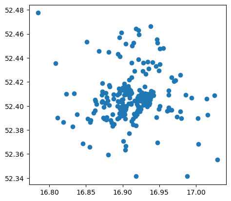
    


```python
type(zabka_poznan)
```


    geopandas.geodataframe.GeoDataFrame


Save the file once again to GeoJSON format:


```python
# Specify the output file path and name
output_file = 'zabka_poznań.geojson'

# Save the GeoDataFrame as a GeoJSON file
zabka_poznan.to_file(output_file, driver='GeoJSON')
```

Let's visualise the distribution of stores in each city side by side: 


```python
# parse the data for each city
gdf_units= {}

gdf_units['Kraków'] = gpd.read_file('zabka_kraków.geojson')
gdf_units['Poznań'] = gpd.read_file('zabka_poznań.geojson')

for city in cities:
    gdf_units[city] = gpd.overlay(gdf_units[city], admin[city])


# visualize the units
f, ax = plt.subplots(1,2, figsize = (15,5))

for idx, city in enumerate(cities):
    admin[city].plot(ax=ax[idx],color='none',edgecolor= 'k', linewidth = 3)
    gdf_units[city].plot( ax=ax[idx], alpha = 0.9, color = very_peri, \
      markersize = 6.0)
    ax[idx].set_title('Locations of Żabka\nstores in ' + city, \
      fontsize = 16)
    ax[idx].axis('off')
```


    
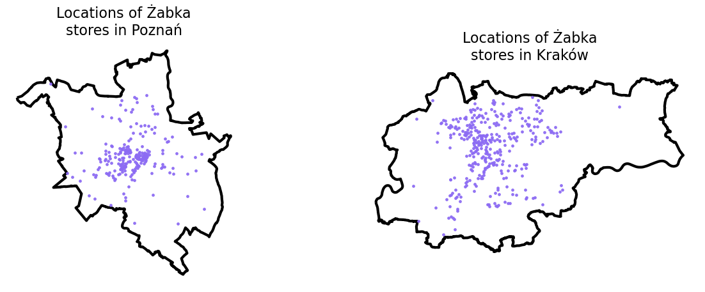
    


## 2. Accessibilty computation

Referencing [this great article](https://towardsdatascience.com/measuring-pedestrian-accessibility-97900f9e4d56) written by Nick Jones in 2018 on how to compute pedestrian accessibility:


```python
import os
!pip install pandana
!pip install osmnet
import pandana # version: 0.6
import pandas as pd # version: 1.4.2
import numpy as np # version: 1.22.4
from shapely.geometry import Point # version:  1.7.1
from pandana.loaders import osm

def get_city_accessibility(admin, POIs):

    # walkability parameters
    walkingspeed_kmh = 5 # est mean walking speed
    walkingspeed_mm  = walkingspeed_kmh * 1000 / 60
    distance = 1609 # metres (1 mile)


    # bounding box as a list of llcrnrlat, llcrnrlng, urcrnrlat, urcrnrlng
    minx, miny, maxx, maxy = admin.bounds.T[0].to_list()
    bbox = [miny, minx, maxy, maxx]

    # setting the input params, going for the nearest POI
    num_pois = 1
    num_categories = 1
    bbox_string = '_'.join([str(x) for x in bbox])
    net_filename = 'data/network_{}.h5'.format(bbox_string)
    if not os.path.exists('data'): os.makedirs('data')

    # precomputing nework distances
    
    if os.path.isfile(net_filename):
        # if a street network file already exists, just load the dataset from that
        network = pandana.network.Network.from_hdf5(net_filename)
        method = 'loaded from HDF5'
    else:
        # otherwise, query the OSM API for the street network within the specified bounding box
        network = osm.pdna_network_from_bbox(bbox[0], bbox[1], bbox[2], bbox[3])
        method = 'downloaded from OSM'

        # identify nodes that are connected to fewer than some threshold of other nodes within a given distance
        lcn = network.low_connectivity_nodes(impedance=1000, count=10, imp_name='distance')
        network.save_hdf5(net_filename, rm_nodes=lcn) #remove low-connectivity nodes and save to h5


    # precomputes the range queries (the reachable nodes within this maximum distance)
    # so, as long as you use a smaller distance, cached results will be used
    network.precompute(distance + 1)
    
    
    # compute accessibilities on POIs
    pois = POIs.copy()
    pois['lon'] = pois.geometry.apply(lambda g: g.x)
    pois['lat'] = pois.geometry.apply(lambda g: g.y)
    pois = pois.drop(columns = ['geometry'])
    network.init_pois(num_categories=num_categories, max_dist=distance, max_pois=num_pois)
    
    network.set_pois(category='all', x_col=pois['lon'], y_col=pois['lat'])

    # searches for the n nearest amenities (of all types) to each node in the network
    all_access = network.nearest_pois(distance=distance, category='all', num_pois=num_pois)

    # transform the results into a geodataframe
    nodes = network.nodes_df
    nodes_acc = nodes.merge(all_access[[1]], left_index = True, right_index = True).rename(columns = {1 : 'distance'})
    nodes_acc['time'] = nodes_acc.distance / walkingspeed_mm
    xs = list(nodes_acc.x)
    ys = list(nodes_acc.y)
    nodes_acc['geometry'] = [Point(xs[i], ys[i]) for i in range(len(xs))]
    nodes_acc = gpd.GeoDataFrame(nodes_acc)
    nodes_acc = gpd.overlay(nodes_acc, admin)
    
    nodes_acc[['time', 'geometry']].to_file(city + '_accessibility.geojson', driver = 'GeoJSON')
    
    return nodes_acc[['time', 'geometry']]


accessibilities = {}
for city in cities:
    accessibilities[city] = get_city_accessibility(admin[city], gdf_units[city])
```

This code block outputs the number of road network nodes in Poznań (105,157) and in Kraków (128,495).


```python
for city in cities:
    print('Number of road network nodes in ' + \
      city + ': ' + str(len(accessibilities[city])))
```

    Number of road network nodes in Poznań: 105157
    Number of road network nodes in Kraków: 128495


```python
for city in cities:
    f, ax = plt.subplots(1,1,figsize=(15,8))
    admin[city].plot(ax=ax, color = 'k', edgecolor = 'k', linewidth = 3)
    accessibilities[city].plot(column = 'time', cmap = 'RdYlGn_r', \
      legend = True,  ax = ax, markersize = 2, alpha = 0.5)
    ax.set_title('Żabka store accessibility in minutes\n' + city, \
      pad = 40, fontsize = 24)    
    ax.axis('off')
```


    
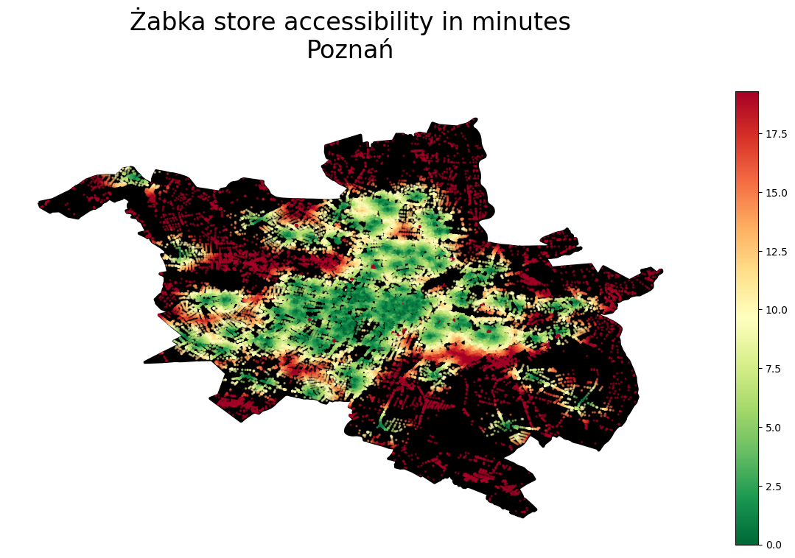
    


    
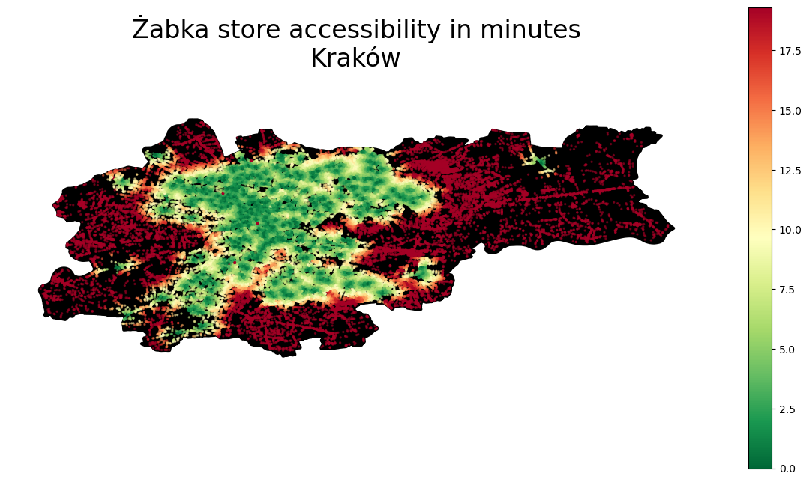
    


## 3. Mapping to H3 grid cells

<div>

</div>

At this point, we have both the population and the accessibility data; we just have to bring them together. The only problem is that their spatial units differ:

- Accessibility is measured and attached to each node within the road network of each city
- Population data is derived from a raster grid, now described by the POI of each raster grid’s centroid

While rehabilitating the original raster grid may be an option, in the hope of a more pronounced universality let's map these two types of point data sets into the [H3 grid system of Uber](https://www.uber.com/en-HU/blog/h3/). For those who haven’t used it before, for now, its enough to know that it’s an elegant, efficient spatial indexing system using hexagon tiles.

I can't stop seeing hexagons now!!!

### 3.1. Creating H3 cells

First, put together a function that splits a city into hexagons at any given resolution:


```python
import geopandas as gpd
import h3 # version: 3.7.3
from shapely.geometry import Polygon # version: 1.7.1
import numpy as np

def split_admin_boundary_to_hexagons(admin_gdf, resolution):
    coords = list(admin_gdf.geometry.to_list()[0].exterior.coords)
    admin_geojson = {"type": "Polygon",  "coordinates": [coords]}
    hexagons = h3.polyfill(admin_geojson, resolution, \
      geo_json_conformant=True)
    hexagon_geometries = {hex_id : Polygon(h3.h3_to_geo_boundary(hex_id, \
      geo_json=True)) for hex_id in hexagons}
    return gpd.GeoDataFrame(hexagon_geometries.items(), columns = ['hex_id', 'geometry'])


resolution = 8  
hexagons_gdf = split_admin_boundary_to_hexagons(admin[city], resolution)
hexagons_gdf.plot()

```

    
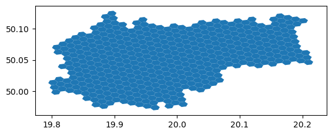
    


Now, see a few different resolutions:


```python
for resolution in [7,8,9]:
    
    admin_h3 = {}
    for city in cities:
        admin_h3[city] = split_admin_boundary_to_hexagons(admin[city], resolution)

    f, ax = plt.subplots(1,2, figsize = (15,5))

    for idx, city in enumerate(cities):
        admin[city].plot(ax=ax[idx], color = 'none', edgecolor = 'k', \
          linewidth = 3)
        admin_h3[city].plot( ax=ax[idx], alpha = 0.8, edgecolor = 'k', \
           color = 'none')
        ax[idx].set_title(city + ' (resolution = '+str(resolution)+')', \
            fontsize = 14)
        ax[idx].axis('off')
```


    
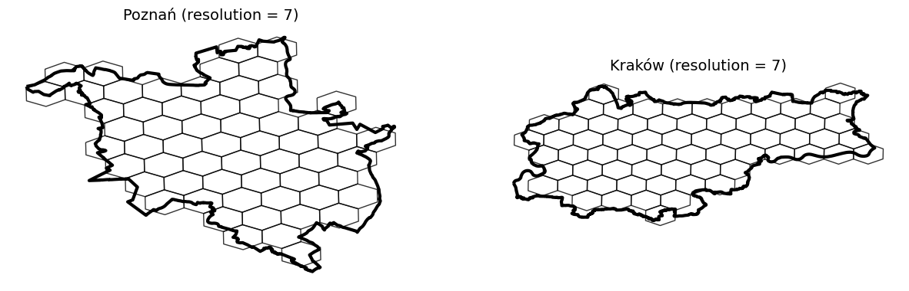
    


    
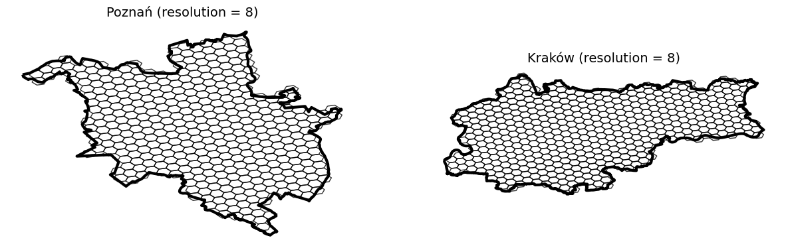
    


    
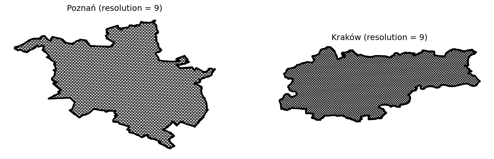
    


Let's stick with resolution 9.

### 3.2. Map values into h3 cells

Now, we have both our cities in a hexagon grid format. Next, we shall map the population and accessibility data into the hexagon cells based on which grid cells each point geometry falls into. For this, the sjoin function of GeoPandasa, doing a nice spatial join, is a good choice.

Additionally, as we have more than 100k road network nodes in each city and thousands of population grid centroids, most likely, there will be multiple POIs mapped into each hexagon grid cell. Therefore, aggregation will be needed. As the population is an additive quantity, we will aggregate population levels within the same hexagon by summing them up. However, accessibility is not extensive, so I would instead compute the average store accessibility time for each tile.


```python
demographics_h3 = {}
accessibility_h3 = {}


for city in cities:

    # do the spatial join, aggregate on the population level of each \
    # hexagon, and then map these population values to the grid ids
    demographics_dict = gpd.sjoin(admin_h3[city], demographics[city]).groupby(by = 'hex_id').sum('population').to_dict()['population']
    demographics_h3[city] = admin_h3[city].copy()
    demographics_h3[city]['population'] = demographics_h3[city].hex_id.map(demographics_dict)

    # do the spatial join, aggregate on the population level by averaging 
    # accessiblity times within each hexagon, and then map these time score  #  to the grid ids
    accessibility_dict = gpd.sjoin(admin_h3[city], accessibilities[city]).groupby(by = 'hex_id').mean('time').to_dict()['time']
    accessibility_h3[city]   = admin_h3[city].copy()
    accessibility_h3[city]['time'] = \
      accessibility_h3[city].hex_id.map(accessibility_dict)

    
    # now show the results
    f, ax = plt.subplots(2,1,figsize = (15,15))

    demographics_h3[city].plot(column = 'population', legend = True, \
      cmap = colormap, ax=ax[0], alpha = 0.9, markersize = 0.25)
    accessibility_h3[city].plot(column = 'time', cmap = 'RdYlGn_r', \
      legend = True,  ax = ax[1])

    ax[0].set_title('Population level\n in ' + city, fontsize = 16)
    ax[1].set_title('Żabka store accessibility in minutes\n in ' + city, \
      fontsize = 16)

    for ax_i in ax: ax_i.axis('off')
```
    
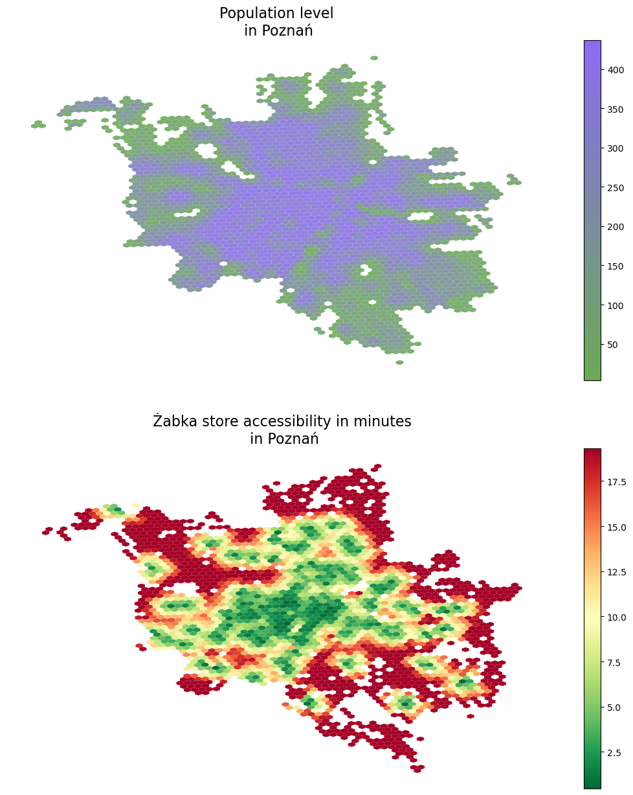
    


    
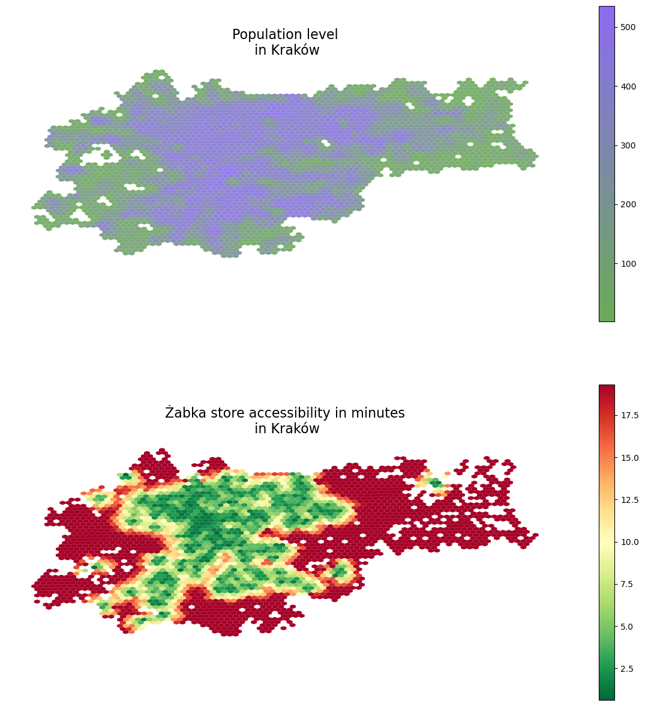
    


## 4. Computing population reach

In this final step, we will estimate the fraction of the reachable population from the nearest Żabka store within a certain amount of time. Here, I still build on the relatively fast 15km/h running pace and the 2.5km distance limit.

From the technical perspective, I merge the H3-level population and accessibility time data frames and then do a simple thresholding on the time dimension and a sum on the population dimension.


```python
f, ax = plt.subplots(1,2, figsize = (15,5))

for idx, city in enumerate(cities):

    total_pop  = demographics_h3[city].population.sum()
    merged = demographics_h3[city].merge(accessibility_h3[city].drop(columns =\
     ['geometry']), left_on = 'hex_id', right_on = 'hex_id')

    time_thresholds = range(20)
    population_reached = [100*merged[merged.time<limit].population.sum()/total_pop for limit in time_thresholds]

    ax[idx].plot(time_thresholds, population_reached, linewidth = 3, \
      color = very_peri)
    ax[idx].set_xlabel('Reachability time (min)', fontsize = 14, \
      labelpad = 12)
    ax[idx].set_ylabel('Fraction of population reached (%)', fontsize = 14, labelpad = 12)
    ax[idx].set_xlim([0,20])
    ax[idx].set_ylim([0,100])
    ax[idx].set_title('Fraction of population vs Żabka store\naccessibility in ' + city, pad = 20, fontsize = 16)

```


    
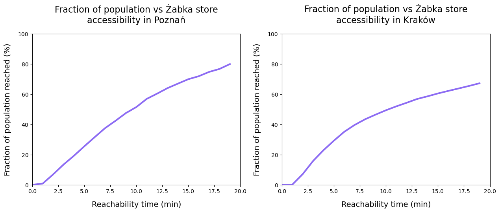
    


## 5. Conclusion

When interpreting these results, I would like to emphasize that the store information obtained from Open Street Maps may not be a comprehensive listing of all Żabka stores.

After this disclaimer, what do we see? On the one hand, we see that in both cities, roughly half of the population can get to a store within a 10 minute walk. Extending walking time to 20 minutes results in around 80% access in Poznań, with around 70% access achieved in Kraków. 

Note that in addition to the caveat of incomplete data, it is important to remember that store accessibility has been calculated based on a walking speed of 5km per hour. This may not be representative of average walking speeds within the cities.

Notwithstanding these reservations, this project provides a solid methodology for combining population data with urban amenity data, to quantify accessibilty. This study can be extended to different cities and amenities across the globe, and the framework is scaleable to different levels of granularity using Uber's innovative H3 grid system.


